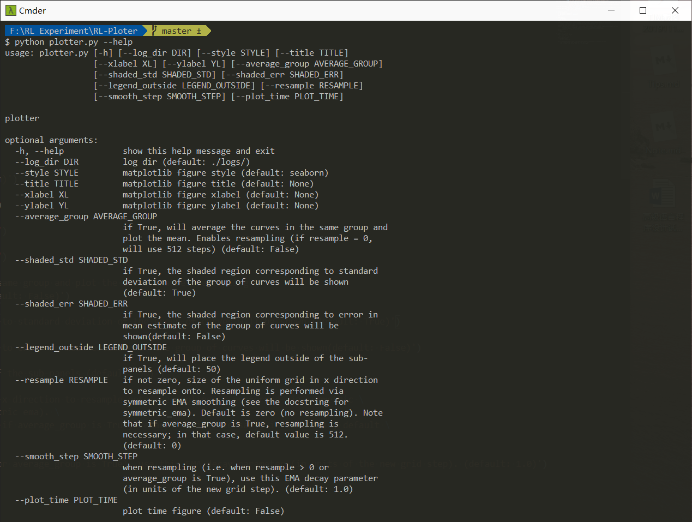

# rl-plotter

 This is a simple tool which can plot learning curves easily for reinforcement learning.

## Requirements

see requirements.txt

### Ussage
```
python plotter.py
```



## To Do

- [x] reinforcement learning plot tools
- [x] timestamp features
- [x] history experiment data plot tools
- [ ] ~~basic data plot tools（including ML-Loss plot）~~
- [ ] ~~dynamic plot tools~~